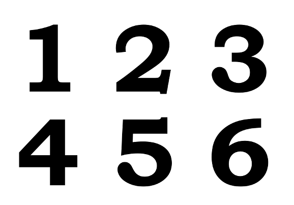
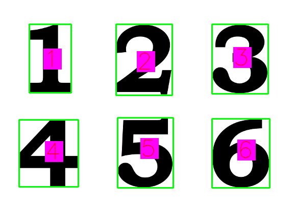

br>```diff
+ Digit Detection
```
Hey there!</br>
Digit detection using machine learning and computer vision.in first step we train our model using ml and dl (keras).</br>
Then using cv2, we detect the numbers and shapes of the image and finally using our model we guess which number is that.the accuracy is not so much because of our rabish model but
its just fun and amazing!
input image : </br></br>

</br>
output:</br></br>

