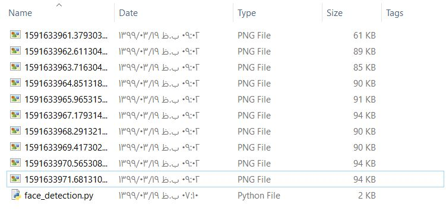

```diff
+ Face Capturer Real Time
```
In this project, using opencv and cascades, we detect the face realtime with camera and then capture and save the faces in the camera.</br>
Remember to copy your own cascade address in opencv main folder then paste in "cascade_locaion" variable.</br> 
For example my cascade location is in "C:\Users\yourUserName\AppData\Local\Programs\Python\Python38-32\Lib\site-packages\cv2\data"</br>
This project can be used for example in security places for saving the picture of people face who enters to that place!</br>
You can increase or decrease the capture frame inside "cv2.waitKey()" method.</br>
As you can see the results, my face is detected and captured and saved in my memory!</br></br>

