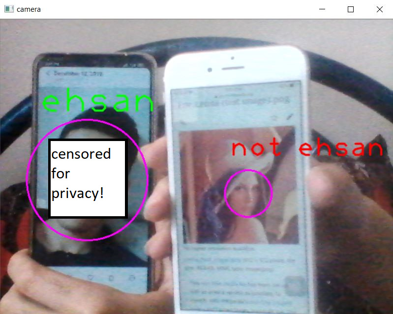

```diff
+ Face Recognizer
```
In this project, using open cv face_cascades and opencvs built in deep learning functions, we made an project to remember your face and detect it!and write up your name to show who you are!</br>
First of all, upload some of your clear face pictures to "/image/" folder inside this project files located folder, then run "face_trainer.py" file to create "trained_data.yml".</br>
Then run "face_detector.py" and thats all! your webcam opens and your face is detected!</br>
If any error happend, remember to "pip install opencv-contrib-python".</br>
Remember to locate your cascade location and put it on "cascade_locaion" variable.</br>
Here is the result: as you see it recognizes my face and writes my name on it but about other face, it cant recognize it becaused we didnt trained her face to be recognized!</br></br>

