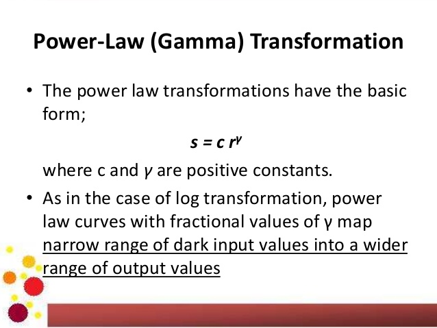

```diff
+ Power Low Transformation
```
In this project, using Power Low transformation, we made the light or dark enhancement of the picture!</br>
As you know, Power Low Transformation is:</br></br>
</br></br>
Our input is this picture:</br></br>
</br></br>
And our result based on different gammas(y) is showed below:</br></br>

