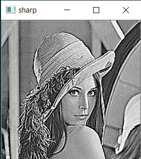

```diff
+ Sharp Filter
```
Making images sharper using convolution and sharp mask(3x3 dimension) : </br>
[[-1 -1 -1]</br>
,[-1  9 -1]</br>
,[-1 -1 -1]]</br>
You can see the result on lenna image:</br></br>

