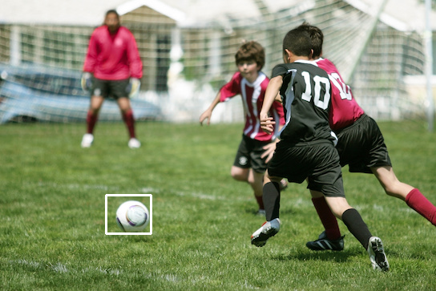

```diff
+ Template Matching
```
Template Matching using opencv.it is one of good(not best) ways to pattern matching and feature extraction ways in image processing.</br>
As you can see, it is frame and the pattern( it is not exact same ball, we want to just see if there is simillar pattern or not!):</br></br>
 </br></br>
And it is the result:</br></br>

